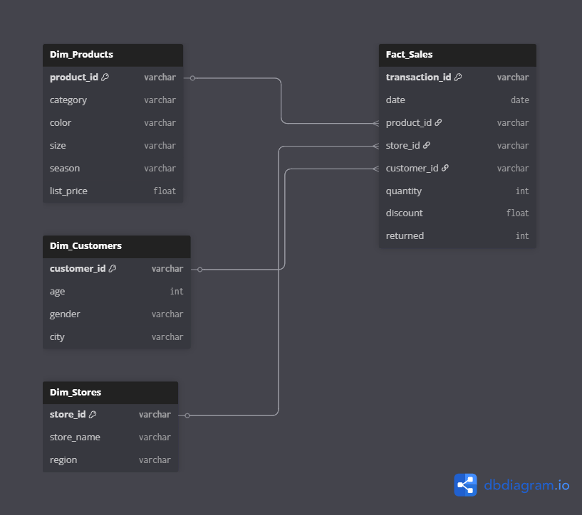

# Lumina Fashion Group: End-to-End Retail Analytics Pipeline 👗📊


### 📈 High-Level Strategy & Insights
[](https://purring-sailboat-492.notion.site/Lumina-Fashion-Group-Retail-Analytics-End-to-End-Pipeline-2b01d3119ed08066b5f9f147da60599c?source=copy_link)
*Visit the full case study for business recommendations and the strategic roadmap.*

## 📊 Project Overview
This project transforms fragmented retail data into a strategic analytical engine. As a **Mathematics Student and Aspiring Data Scientist**, I leveraged mathematical rigor to unify sales, customer, product, and store domains. The objective was to build a robust data infrastructure to identify critical inefficiencies in discount strategies and seasonal inventory management.

## 🏗️ Phase 0: Data Engineering & Pre-Processing

### 🔬 Initial Data Audit (The "Dirty" Data)
Before any analysis, a deep audit was conducted to ensure data reliability and mathematical integrity:
* **Missing Values Detected:** 496 missing emails, 990 missing colors, and 1,844 missing `customer_id` entries in the Sales dataset.
* **Strategic Imputation:** Missing customer IDs were tagged as **"GUEST-001"**. This decision preserves total transaction volume (1,844 records) while preventing the skewing of CRM and Loyalty Program metrics.
* **Formatting:** Converted date strings into standardized ISO Datetime objects to enable precise time-series decomposition.

### 🏗️ Relational Architecture (Star Schema)
To ensure analytical scalability, I transformed raw CSV datasets into a **Relational Star Schema**. This architecture decouples quantitative metrics from descriptive attributes, optimizing query performance.

<p align="center">
  
</p>

### ⚙️ Automated ETL Migration
I implemented an automated ingestion layer using **SQLAlchemy** to migrate data from the local environment to a **PostgreSQL** instance, ensuring data type enforcement across 50,000+ records.

## 🛠️ Phase 1: Extraction & Integration (Master SQL)
I developed a robust SQL pipeline to handle data fragmentation at the source level. This "Master Query" performs multi-way JOINs and cleans corrupted entries before they reach the Python analytical environment:

```sql
SELECT 
    s.transaction_id,
    s.date::DATE, 
    -- Handling missing Customer IDs to prevent data loss
    COALESCE(s.customer_id, 'GUEST-001') as customer_id, 
    p.season,
    st.store_name,
    st.region,
    -- Data Sanitization: Replacing corrupted '???' strings with 'Other'
    REPLACE(p.category, '???', 'Other') as category, 
    COALESCE(p.color, 'Unspecified') as color, 
    s.quantity,
    p.list_price,
    -- Financial Normalization: Treating null discounts as zero for margin calculation
    COALESCE(s.discount, 0) as discount_pct, 
    (s.quantity * p.list_price) * (1 - COALESCE(s.discount, 0)) as net_revenue 
FROM sales s
LEFT JOIN customers c ON s.customer_id = c.customer_id
JOIN products p ON s.product_id = p.product_id
JOIN stores st ON s.store_id = st.store_id;
```

## 🔬 Phase 2: Exploratory Data Analysis (EDA)

### 📈 Temporal Characteristics & Seasonality
* **Discovery:** Revenue remains stable month-over-month (~$2.5M), but analysis revealed a significant **"Season-Month Mismatch."**
* **Finding:** Products labeled as "Winter" or "Summer" sell at uniform rates regardless of the month, indicating an opportunity for more aggressive seasonal clearance strategies to optimize inventory turnover.

<p align="center">
  
</p>

### 🎯 The Discount Elasticity Paradox (Technical "Hook")

> [!IMPORTANT]
> **Financial Insight:** By using **Median-based aggregation** to neutralize transaction outliers, I proved that discounts >20% showed a near-zero correlation with volume increase. The median quantity remained constant at **3 units**, proving that Lumina was sacrificing net margins without driving a proportional volume uplift.

<p align="center">
  
</p>

### 🗺️ Geospatial & Attribute Performance
* **Hero Products:** Heatmap analysis identified **"White"** staples in Accessories and Dresses as the highest-frequency transaction clusters across the entire ecosystem.
* **Regional Balance:** Revenue is remarkably balanced across regions, with the **Online Store** performing at par with physical boutiques (~$2.43M), suggesting a high ceiling for digital-first scaling.

<p align="center">
  
</p>

## 🛠️ Tech Stack & Requirements
* **Core:** Python 3.13, SQL (PostgreSQL logic).
* **Libraries:** Pandas, NumPy, Seaborn, Matplotlib, SQLAlchemy.
* **Environment:** Jupyter Notebooks.

## 📂 Repository Structure
* **data/**: Raw CSV files.
* **images/**: ERD diagrams, Heatmaps, and Trend plots.
* **requirements.txt**: Environment dependencies.
* **Lumina Fashion Group Analysis.ipynb**: Full implementation (Engineering + EDA).

## 🛠️ Setup & Quick Start
1. **Clone the repository**:  
   `git clone https://github.com/JesusAHB25/Lumina-Fashion-Group-End-to-End-Retail-Analytics-Pipeline.git`
2. **Install dependencies**:  
   `pip install -r requirements.txt`
3. **Configure your local PostgreSQL URI** in the notebook.
4. **Open Lumina Fashion Group Analysis.ipynb** and run the cells to replicate the pipeline.

---
*Developed by **Jesús** | Mathematics Student & Aspiring Data Scientist* 🤖🧿
